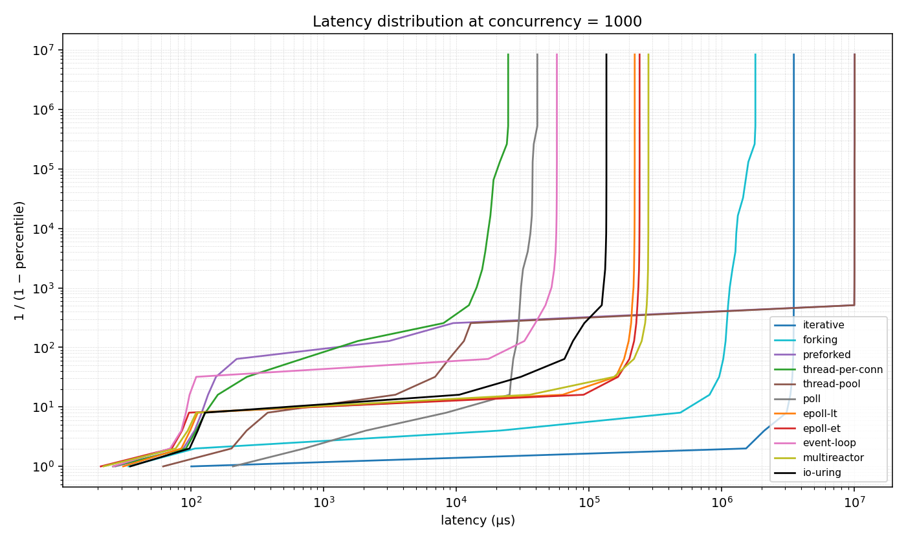
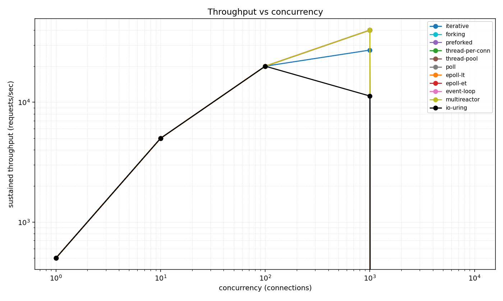
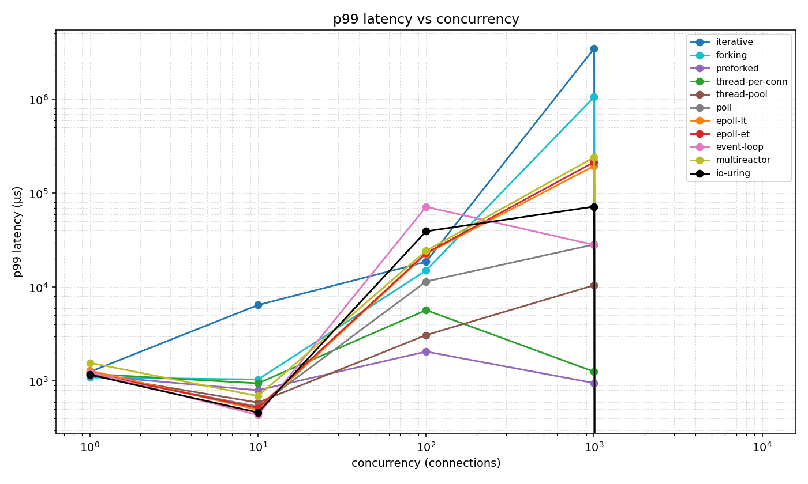
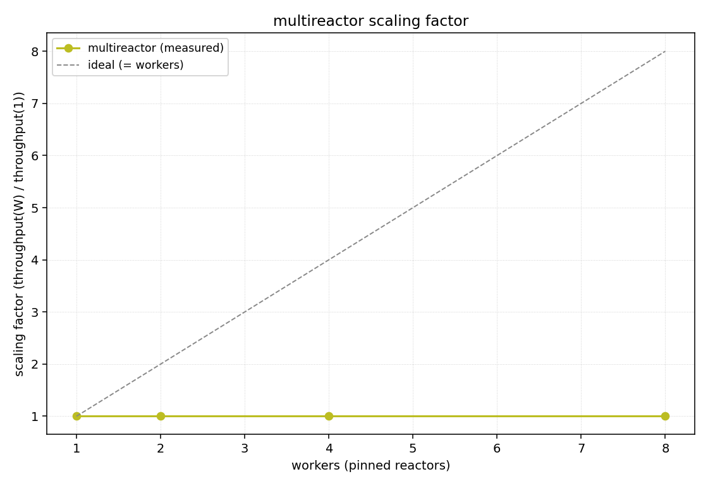

# BENCHMARKS — TCP server I/O models, measured

## 1. Thesis

This repository implements every TCP server I/O model from the single-thread
accept loop to a purpose-built `io_uring` completion engine — eleven models —
behind one `Server` trait and one frozen sans-IO `core::Connection` state
machine. This document is the measured teardown: throughput, full latency
distributions, syscalls per request, and context switches per request for each
model, taken from committed CSVs and histogram dumps under `bench/results/_archive-laptop-i5-1135G7/`.
Every number below cites the file it came from. Where a model underperformed
its hypothesis, or where the harness itself constrained the result, that is
stated rather than hidden.

## 2. Environment & methodology

**Host** (recorded in `bench/results/_archive-laptop-i5-1135G7/profiles/README.md`):

| Property | Value |
|---|---|
| CPU | 11th Gen Intel Core i5-1135G7 @ 2.40 GHz |
| Cores / threads | 4 physical / 8 logical |
| RAM | 8 GiB (`MemTotal: 7,322,952 kB`, `bench/results/_archive-laptop-i5-1135G7/c10k_README.md`) |
| Kernel | `Linux 7.0.0-15-generic` (Ubuntu 26.04 LTS) |
| Network | loopback only (`127.0.0.1`) |

The kernel is well above the `io_uring` floor of 5.19 required by the model
(`docs/specs/phase2-spec.md` §5), so `io_uring` ran natively rather than being
recorded N/A.

**Load model.** The load generator is open-loop and corrected for coordinated
omission: requests are scheduled at a fixed offered rate and each request's
latency is measured from the time it *should* have been sent, not from the time
a connection became free. A backlogged server therefore shows the backlog in
its tail rather than hiding it by slowing the request stream. Results are
emitted as HDR-histogram dumps (`value_us,percentile,total_count,
inverse_1_minus_p` — e.g. `bench/results/_archive-laptop-i5-1135G7/epoll-et_r40000_c1000.hgrm`) and
per-point summary CSVs.

**Sweep.** `bench/run.sh` drives every model across concurrency
`1 / 10 / 100 / 1000 / 10000` at offered rates `500 / 5000 / 20000 / 40000 /
50000` rps, 10 s per point (`bench/results/_archive-laptop-i5-1135G7/sweep.log`), appending rows to
`bench/results/_archive-laptop-i5-1135G7/<model>.csv`. Because the load is rate-capped, a model that
keeps up reports throughput equal to the offered rate; the differentiator at a
given rung is the latency distribution and the error count.

**C10K.** `bench/c10k.sh` holds each model at a fixed high concurrency for 30 s
while sampling `/proc/<pid>/status` (VmRSS, ctx-switch counters) and the live
fd count, writing the resource curve to `bench/results/_archive-laptop-i5-1135G7/c10k_<model>.log` and a
verdict row to `bench/results/_archive-laptop-i5-1135G7/c10k_summary.csv`.

**Profiling.** `bench/profile.sh` captures syscalls/req (`strace -c -f`) and
ctx-switches/req (summed `/proc/<pid>/task/*/status`) for the three signal
models, into `bench/results/_archive-laptop-i5-1135G7/profiles/`.

**One-command reproduction:**

```
cargo build --release
bash bench/run.sh        # the 11-model sweep
bash bench/c10k.sh       # the C10K resource curves
bash bench/scaling.sh    # the multireactor scaling study
bash bench/profile.sh    # syscalls/req + ctx-switches/req
python3 bench/plot.py    # regenerate every plot in bench/results/
```

## 3. Threats to validity

These are the reasons a number here might not transfer, stated plainly. They
are the load-bearing caveats; nothing below is reported without them.

- **Coordinated omission** is handled at the source: latency is measured from
  scheduled send time, so the open-loop tail is the real queueing tail. This is
  why the p99/p99.9 columns are large (tens to hundreds of ms) even where p50
  is sub-100 µs — the tail is the backlog, not measurement noise.
- **No discarded warmup.** Each sweep point runs 10 s with no separate warmup
  interval removed, so first-request connection setup and cold asset-cache
  touches land in the tail of every point. This inflates tails uniformly across
  models rather than favouring one.
- **Held constant:** the same host, the same frozen `core::Connection`, the
  same single served asset, the same load generator, and the same offered rate
  at each concurrency rung, for all eleven models.
- **Asset page cache.** The served asset is warm in the page cache for the
  whole run; no model pays disk I/O. This is a deliberate isolation of the
  concurrency/I-O strategy, not a model of a cold-cache file server.
- **Loopback, not a network.** There is no NIC, no real RTT, no loss, and no
  segmentation cost. Absolute throughput is higher and tail latency lower than
  a real network would give; the *ordering* between models is the transferable
  result, not the absolute numbers.
- **Single-host loadgen contention.** The load generator runs on the same 8
  logical cores as the server. This directly inflates `multireactor`'s
  nonvoluntary context switches (8 pinned reactors contend with 100 loadgen
  threads on 8 cores — `bench/results/_archive-laptop-i5-1135G7/profiles/README.md`) and is the honest
  reason its ctx-switches/req is the highest of the three profiled models.
- **C10K capped at 8000 connections.** The loadgen cannot `pthread_create`
  10,000 worker threads on this host: `Committed_AS` already sits 2.3 GiB above
  `CommitLimit` under `vm.overcommit_memory=0`, so new thread-stack
  reservations fail with `EAGAIN` (`bench/results/_archive-laptop-i5-1135G7/c10k_README.md`). 8000 is the
  highest concurrency that fits. The c=10000 rung of every sweep CSV is
  therefore recorded as a dropout (`throughput_rps=0.0`) with one of two
  sentinels in the `errors` column: `-1` = server fell over inside the
  `POINT_BUDGET` wall clock; `-2` = loadgen hit the host thread limit before
  the server was tested. Both are explained in `bench/results/_archive-laptop-i5-1135G7/c10k_README.md`.
- **Top-down microarchitecture unavailable.** `perf_event_paranoid = 4` on this
  kernel denies event access to non-`CAP_PERFMON` users, and root is not
  available, so `perf stat` opens no events (`bench/results/_archive-laptop-i5-1135G7/profiles/
  README.md`). The §7 privilege fallback was taken instead:
  `/proc/<pid>/status` ctx-switch counters plus `strace -c`. Retiring /
  bad-speculation / frontend-bound / backend-bound decomposition is omitted
  from this document. The two metrics that carry the `io_uring`-vs-epoll story
  — syscalls/req and ctx-switches/req — were recovered.

## 4. Headline results

Throughput and latency at C=100 are from the sweep CSVs (`bench/results/_archive-laptop-i5-1135G7/
<model>.csv`, offered rate 20000 rps). The C10K rung is from the C10K capture
at 8000 connections / 50000 rps offered (`bench/results/_archive-laptop-i5-1135G7/c10k_<model>.csv` and
`bench/results/_archive-laptop-i5-1135G7/c10k_summary.csv`). Syscalls/req and ctx-switches/req are from
`bench/results/_archive-laptop-i5-1135G7/profiles/summary.csv` and were measured only for the three
signal models (`epoll-et`, `multireactor`, `io-uring`); `—` marks a model that
was not profiled at the microarchitecture level.

| Model | Concurrency | Throughput (req/s) | p50 (µs) | p99 (µs) | p99.9 (µs) | Syscalls/req | Ctx-switches/req |
|---|---|---|---|---|---|---|---|
| iterative | C=100 | 20000 | 94 | 18607 | 35967 | — | — |
| iterative | C=8000 | saturated (no completion) | — | — | — | — | — |
| forking | C=100 | 20000 | 95 | 15055 | 40575 | — | — |
| forking | C=8000 | server panic on thread spawn | — | — | — | — | — |
| preforked | C=100 | 20000 | 92 | 2061 | 4119 | — | — |
| preforked | C=8000 | saturated (no completion) | — | — | — | — | — |
| thread-per-conn | C=100 | 20000 | 101 | 5695 | 17551 | — | — |
| thread-per-conn | C=8000 | server panic on thread spawn | — | — | — | — | — |
| thread-pool | C=100 | 20000 | 154 | 3091 | 7215 | — | — |
| thread-pool | C=8000 | 16569.6 (1,002,913 errors) | 75 | 118207 | 150399 | — | — |
| poll | C=100 | 20000 | 277 | 11495 | 13119 | — | — |
| poll | C=8000 | 50000 (0 errors) | 9975 | 293631 | 345855 | — | — |
| epoll-lt | C=100 | 20000 | 85 | 22639 | 40799 | — | — |
| epoll-lt | C=8000 | 50000 (0 errors) | 457215 | 1514495 | 1616895 | — | — |
| epoll-et | C=100 | 20000 | 81 | 23055 | 42495 | 4.024 | 1.008 |
| epoll-et | C=8000 | 50000 (0 errors) | 157 | 471551 | 483071 | 4.024 | 1.008 |
| event-loop | C=100 | 20000 | 85 | 71679 | 132223 | — | — |
| event-loop | C=8000 | 50000 (0 errors) | 63519 | 375551 | 391167 | — | — |
| multireactor | C=100 | 20000 | 93 | 24399 | 35711 | 4.059 | 1.153 |
| multireactor | C=8000 | 50000 (0 errors) | 86 | 366335 | 456703 | 4.059 | 1.153 |
| io-uring | C=100 | 20000 | 77 | 39327 | 62655 | 2.015 | 1.006 |
| io-uring | C=8000 | 18402.4 (947,927 errors) | 83 | 16463 | 131839 | 2.015 | 1.006 |

Sources: C=100 rows from each `bench/results/_archive-laptop-i5-1135G7/<model>.csv` (row `rate=20000,
connections=100`); C=8000 rows from `bench/results/_archive-laptop-i5-1135G7/c10k_<model>.csv` and
`bench/results/_archive-laptop-i5-1135G7/c10k_summary.csv`; syscalls/req and ctx-switches/req from
`bench/results/_archive-laptop-i5-1135G7/profiles/summary.csv`.

Two facts dominate the table and are taken up in §7 and §9. First, every
event-loop model and `multireactor` carry 8000 concurrent connections at the
full offered 50000 rps with zero errors; the thread- and process-per-connection
models do not reach that rung at all. Second, `io_uring` runs the workload at
**half** the syscalls/req of `epoll-et` (2.015 vs 4.024, `bench/results/_archive-laptop-i5-1135G7/
profiles/summary.csv`) yet sheds load at C=8000 — the syscall win and the
throughput loss are both real and have the same cause: one ring on one thread.

## 5. Plots

All plots are regenerated by `python3 bench/plot.py` from the committed CSVs and
histogram dumps.

**Interior latency distribution, log-y (C=100 and C=1000).** Per-model HDR
histograms; the log-y axis shows the full tail, not only the body.


*Source: the `*_r20000_c100.hgrm` dumps in `bench/results/_archive-laptop-i5-1135G7/`.*



*Source: the `*_r40000_c1000.hgrm` dumps in `bench/results/_archive-laptop-i5-1135G7/`.*

**Throughput vs concurrency.**



*Source: the `throughput_rps` column of every `bench/results/_archive-laptop-i5-1135G7/<model>.csv`.*

**p99 vs concurrency.**



*Source: the `p99` column of every `bench/results/_archive-laptop-i5-1135G7/<model>.csv`.*

**multireactor scaling factor.**



*Source: `bench/results/_archive-laptop-i5-1135G7/multireactor_scaling.csv`. See §6 for why the
throughput scaling factor is flat and where the scaling signal actually lives.*

## 6. multireactor scaling study

`bench/scaling.sh` swept `multireactor --workers` = 1, 2, 4, 8 at fixed
concurrency 1000 / offered 80000 rps, 15 s per point
(`bench/results/_archive-laptop-i5-1135G7/scaling.log`, `bench/results/_archive-laptop-i5-1135G7/multireactor_scaling.csv`):

| Workers | Throughput (req/s) | p50 (µs) | p99 (µs) | p99.9 (µs) |
|---|---|---|---|---|
| 1 | 80000.0 | 376575 | 615935 | 624639 |
| 2 | 80000.0 | 100 | 346879 | 385279 |
| 4 | 80000.0 | 98 | 421887 | 439551 |
| 8 | 80000.0 | 115 | 327935 | 350975 |

The throughput-based scaling factor (`throughput@N ÷ throughput@1`) is **flat at
1.0×** across all worker counts, which is not the near-linear curve §6 of the
spec anticipated. The reason is methodological, and stated rather than dressed
up: at 80000 rps offered the workload is rate-capped *below* the saturation
point of every configuration with two or more reactors, so each of them
reports the offered rate unchanged. The scaling signal did not vanish; it moved into the
latency column. A single reactor at 80000 rps is saturated — p50 = 376575 µs
(376 ms), the queue never drains — while two reactors serve the same offered
load at p50 = 100 µs, a 3766× reduction in median latency from one worker to
two. Beyond two reactors p50 stays at ≈ 100 µs because the offered rate, not
the reactors, is now the limit. The honest correction to the study: to read a
throughput scaling factor one must drive each configuration to its own
saturation point, which this fixed-rate sweep does not do. What it does show
unambiguously is that a single pinned reactor cannot absorb 80000 rps and a
second one removes the backlog entirely.

## 7. Per-model mechanism

Throughput at C=100 is the full offered 20000 rps for every model that keeps up
(open-loop, rate-capped); the differentiator at that rung is p99. The C=8000
figures are the C10K rung. The three signal models carry the syscalls/req and
ctx-switches/req profile (`bench/results/_archive-laptop-i5-1135G7/profiles/summary.csv`); the other
eight were not profiled at that level and top-down decomposition is unavailable
on this host for all of them (§3).

> **iterative.** Single thread, one `accept()`→serve→`close` at a time, the
> reference model. At C=100 it serves the full 20000 req/s (p99 = 18607 µs)
> [`bench/results/_archive-laptop-i5-1135G7/iterative.csv`]; at C=8000 it does not complete — the single
> serving thread cannot drain 8000 connections inside the budget and the point
> is recorded `saturated` [`bench/results/_archive-laptop-i5-1135G7/c10k_summary.csv`]. Not profiled at
> the syscall level; top-down unavailable (§3). With exactly one request in
> flight, head-of-line blocking is total: every connection waits behind the one
> being served, which is why the C=100 tail is already in the tens of ms even
> at the offered rate. It breaks the moment concurrency exceeds what one
> sequential server can clear — it has no mechanism for the second connection.
> It represents the tradeoff of minimum mechanism for zero concurrency.

> **forking.** One `fork()` per connection, children reaped via `SIGCHLD`. At
> C=100 it serves 20000 req/s (p99 = 15055 µs) [`bench/results/_archive-laptop-i5-1135G7/forking.csv`];
> at C=8000 the server process panics spawning the child for connection N with
> `Os { code: 11, kind: WouldBlock, message: "Resource temporarily unavailable" }`
> [`bench/results/_archive-laptop-i5-1135G7/c10k_server_forking.log`], the `EAGAIN`-on-clone wall.
> Not profiled; top-down unavailable (§3). A process per connection means a
> full address space and scheduler entity per connection; the host runs out of
> the memory to commit thread/process stacks long before 8000. It breaks at
> process-table / commit exhaustion. It represents the tradeoff of hard fault
> isolation (a crashing connection cannot corrupt a sibling) paid for in the
> heaviest possible per-connection unit.

> **preforked.** A fixed pool of 8 worker processes, each with its own
> `SO_REUSEPORT` listener, kernel-balanced. At C=100 it serves 20000 req/s with
> the tightest tail of the process/thread group (p99 = 2061 µs, p99.9 = 4119
> µs) [`bench/results/_archive-laptop-i5-1135G7/preforked.csv`]; at C=8000 the 8 workers cannot drain the
> connections and the point is `saturated` [`bench/results/_archive-laptop-i5-1135G7/c10k_summary.csv`].
> Not profiled; top-down unavailable (§3). The tight C=100 tail is the payoff
> of a warm, fixed worker set with no per-connection fork cost and no thundering
> herd (`SO_REUSEPORT` over a shared listener fd). It breaks when offered
> concurrency exceeds what 8 blocking workers can serve: each worker is still a
> blocking accept-loop, so 8000 connections queue 8-wide. It represents the
> tradeoff of process isolation with bounded, warm capacity — superseded on
> scaling by the event-loop models that multiplex thousands of connections per
> thread.

> **thread-per-conn.** One OS thread per connection, uncapped (the failure mode
> kept deliberately, per the kickoff brief). At C=100 it serves 20000 req/s
> (p99 = 5695 µs) [`bench/results/_archive-laptop-i5-1135G7/thread-per-conn.csv`]; at C=8000 it panics
> spawning the per-connection thread with the same `EAGAIN`/`WouldBlock` as
> forking, after RSS has climbed to 121104 KiB (≈ 118 MiB) and 4608 fds
> [`bench/results/_archive-laptop-i5-1135G7/c10k_server_thread-per-conn.log`, `bench/results/_archive-laptop-i5-1135G7/
> c10k_thread-per-conn.log`, `bench/results/_archive-laptop-i5-1135G7/c10k_summary.csv`]. Not profiled;
> top-down unavailable (§3). Threads are cheaper than processes (shared address
> space, the good C=100 tail) but each still reserves a stack; 4608 of them is
> where this host's commit limit bites. It breaks at thread-stack commit
> exhaustion around 4–5k connections here. It represents the tradeoff of the
> simplest concurrent code (write blocking I/O, let the scheduler interleave)
> against unbounded per-connection memory — the canonical reason the C10K
> problem exists.

> **thread-pool.** A bounded worker pool draining a shared job queue with
> explicit backpressure. At C=100 it serves 20000 req/s (p99 = 3091 µs)
> [`bench/results/_archive-laptop-i5-1135G7/thread-pool.csv`]; at C=8000 it stays up but sheds heavily —
> 16569.6 req/s with 1,002,913 of 1,500,000 requests errored, p99 = 118207 µs
> [`bench/results/_archive-laptop-i5-1135G7/c10k_thread-pool.csv`, `bench/results/_archive-laptop-i5-1135G7/c10k_summary.csv`].
> Not profiled; top-down unavailable (§3). RSS stays flat (≈ 3 MiB,
> `bench/results/_archive-laptop-i5-1135G7/c10k_thread-pool.log`) because the pool is bounded — that is
> the point of it — but a bounded set of blocking workers cannot hold 8000
> simultaneously slow connections, so backpressure converts excess load into
> errors instead of memory growth. It breaks by shedding load, not by dying.
> It represents the tradeoff of bounded, predictable resource use against an
> inability to *hold* (as opposed to serve) many concurrent connections — a
> blocking pool has no idle-connection parking.

> **poll.** Single-thread `poll(2)` readiness loop, the O(n)-scan baseline that
> exists to make epoll's improvement measurable. At C=100 it serves 20000 req/s
> (p99 = 11495 µs) [`bench/results/_archive-laptop-i5-1135G7/poll.csv`]; at C=8000 it carries all 8000
> connections at the full 50000 rps with 0 errors, but at p50 = 9975 µs and
> p99 = 293631 µs [`bench/results/_archive-laptop-i5-1135G7/c10k_poll.csv`], RSS rising to 10176 KiB and
> fds to 8004 [`bench/results/_archive-laptop-i5-1135G7/c10k_poll.log`]. Not profiled; top-down
> unavailable (§3). It holds 8000 connections because it parks in `poll` like
> the epoll models — but every wakeup rescans the entire fd set, so the median
> latency is two orders of magnitude worse than epoll-et's at the same rung
> (9975 µs vs 157 µs). It breaks by latency, not capacity: the O(n) descriptor
> scan, not memory. It represents the tradeoff of a readiness event loop
> without a scalable readiness primitive.

> **epoll-lt.** Single-thread level-triggered `epoll`, non-blocking sockets,
> driving the `core::Connection` machine. At C=100 it serves 20000 req/s
> (p99 = 22639 µs) [`bench/results/_archive-laptop-i5-1135G7/epoll-lt.csv`]; at C=8000 it carries all 8000
> at 50000 rps with 0 errors but the worst median of any surviving model —
> p50 = 457215 µs (457 ms), p99 = 1514495 µs (1.5 s)
> [`bench/results/_archive-laptop-i5-1135G7/c10k_epoll-lt.csv`], RSS flat at ≈ 10 MiB
> [`bench/results/_archive-laptop-i5-1135G7/c10k_epoll-lt.log`]. Not profiled at syscall level; top-down
> unavailable (§3). Level-triggered readiness re-fires for every fd that is
> still readable/writable on every `epoll_wait`, so under 8000 active
> connections the loop spends its wakeups re-servicing already-known readiness;
> the backlog shows directly as the half-second median. It breaks by latency
> collapse under the LT re-notification load. It represents the tradeoff of the
> simpler epoll mode (no drain-to-`EAGAIN` discipline) against re-notification
> cost that becomes ruinous at scale — the precise motivation for edge-trigger.

> **epoll-et.** Single-thread edge-triggered `epoll`: drain each socket to
> `EAGAIN`, manage `EPOLLOUT` for partial writes, one `core::Connection` per fd.
> At C=100 it serves 20000 req/s (p99 = 23055 µs) [`bench/results/_archive-laptop-i5-1135G7/
> epoll-et.csv`]; at C=8000 it carries all 8000 at 50000 rps with 0 errors at
> p50 = 157 µs — three orders of magnitude below epoll-lt's median at the same
> rung — and p99 = 471551 µs [`bench/results/_archive-laptop-i5-1135G7/c10k_epoll-et.csv`], RSS flat at
> 10056 KiB, fds returning to 5 after drain [`bench/results/_archive-laptop-i5-1135G7/c10k_epoll-et.log`].
> The profile is **4.024 syscalls/req** (1×`epoll_wait`, 1×`sendto`,
> 2×`recvfrom`) and **1.008 ctx-switches/req** [`bench/results/_archive-laptop-i5-1135G7/profiles/
> summary.csv`, `bench/results/_archive-laptop-i5-1135G7/profiles/strace_epoll-et.txt`]. The second
> `recvfrom` is the edge-trigger drain returning `EAGAIN` to re-arm readiness —
> the deliberate cost of not re-notifying. It breaks only in the tail under
> backlog (the p99 is the open-loop queue), never in capacity or memory at this
> scale. It represents the tradeoff of strict drain/partial-write discipline
> against the lowest steady-state syscall count of any readiness model here.

> **event-loop.** The same epoll-ET mechanism behind a clean reactor
> abstraction with explicit buffer management — the architectural artifact and
> the direct microVM-multiplexer ancestor. At C=100 it serves 20000 req/s but
> with the widest C=100 tail of the event-loop group (p99 = 71679 µs)
> [`bench/results/_archive-laptop-i5-1135G7/event-loop.csv`]; at C=1000 that inverts — p99 = 28175 µs vs
> epoll-et's 214783 µs [`bench/results/_archive-laptop-i5-1135G7/event-loop.csv`,
> `bench/results/_archive-laptop-i5-1135G7/epoll-et.csv`]; at C=8000 it carries all 8000 at 50000 rps
> with 0 errors, p50 = 63519 µs, p99 = 375551 µs
> [`bench/results/_archive-laptop-i5-1135G7/c10k_event-loop.csv`], RSS flat at ≈ 10 MiB
> [`bench/results/_archive-laptop-i5-1135G7/c10k_event-loop.log`]. Not profiled at syscall level; top-down
> unavailable (§3) — so the "zero-cost over bare epoll-et" hypothesis is
> examined on latency only, and it does **not** hold cleanly (§9). It breaks
> only in the tail under backlog. It represents the tradeoff of a reusable
> reactor structure whose latency profile diverges from hand-rolled epoll-ET
> rather than matching it exactly.

> **multireactor.** Shared-nothing: `num_cores()` reactor threads, each pinned
> to a core with its own `SO_REUSEPORT` listener, no acceptor, no fd handoff, no
> shared hot-path state; the kernel 4-tuple-hashes connections across the
> per-reactor listeners. At C=100 it serves 20000 req/s (p99 = 24399 µs)
> [`bench/results/_archive-laptop-i5-1135G7/multireactor.csv`]; at C=8000 it carries all 8000 at 50000 rps
> with 0 errors at the best median of any surviving model, p50 = 86 µs (p99 =
> 366335 µs) [`bench/results/_archive-laptop-i5-1135G7/c10k_multireactor.csv`], RSS flat at ≈ 10 MiB, fds
> returning to 19 after drain [`bench/results/_archive-laptop-i5-1135G7/c10k_multireactor.log`]. The
> profile is **4.059 syscalls/req** — per-reactor identical to epoll-et's,
> because shared-nothing means no shared syscall — and **1.153
> ctx-switches/req**, the highest of the three, from 9592 nonvoluntary switches
> [`bench/results/_archive-laptop-i5-1135G7/profiles/summary.csv`, `bench/results/_archive-laptop-i5-1135G7/profiles/
> strace_multireactor.txt`]. That nonvoluntary tail is the documented cost of
> running 8 pinned reactors and the load generator on the same 8 logical cores
> (§3), not a property of the model. It breaks under skewed connection lifetimes
> — kernel-hash balancing has no work-stealing, so a hot reactor cannot offload
> (the caveat `phase2-spec.md` §4 warns about). It represents the tradeoff of
> near-linear multicore scaling with zero shared state against load-imbalance
> under skew.

> **io-uring.** Completion-based, purpose-built: a single ring on a single
> thread, multishot accept, provided buffer rings (the kernel selects the read
> buffer and reports it in the CQE), batched submission — the same unmodified
> `core::Connection` driven by completions instead of readiness. At C=100 it
> serves 20000 req/s at the lowest p50 of any model, 77 µs (p99 = 39327 µs)
> [`bench/results/_archive-laptop-i5-1135G7/io-uring.csv`]; at C=1000 it sheds load — 11270.3 req/s with
> 287297 errors, though at low served-latency p99 = 72127 µs
> [`bench/results/_archive-laptop-i5-1135G7/io-uring.csv`]; at C=8000 it serves 18402.4 req/s with 947927
> errors, p99 = 16463 µs on what it serves [`bench/results/_archive-laptop-i5-1135G7/c10k_io-uring.csv`].
> The profile is the headline: **2.015 syscalls/req** (≈ 2×`io_uring_enter`,
> one for the read side and one for the write side; multishot accept and
> provided buffers eliminate the per-accept and per-read syscalls) and **1.006
> ctx-switches/req** [`bench/results/_archive-laptop-i5-1135G7/profiles/summary.csv`,
> `bench/results/_archive-laptop-i5-1135G7/profiles/strace_io-uring.txt`] — half the syscalls/req of
> epoll-et. It breaks by shedding load above C≈1000: one ring on one thread is a
> single serialization point and cannot match N pinned reactors for absolute
> throughput. It represents the tradeoff of the lowest syscall cost achievable
> on this workload against single-ring/single-thread throughput and kernel
> dependence.

## 8. The io_uring verdict

The fair axis is single-ring, single-thread `io_uring` against single-thread
`epoll-et` — both are one event engine on one thread, isolating
syscall-elimination from core count. On that axis:

- **Syscalls/req: 2.015 (io-uring) vs 4.024 (epoll-et)** — a 2.00× reduction
  [`bench/results/_archive-laptop-i5-1135G7/profiles/summary.csv`]. The mechanism is exact: epoll-et pays
  `1×epoll_wait + 2×recvfrom + 1×sendto` per request (the second `recvfrom` is
  the edge-trigger drain to `EAGAIN`), totalling ≈ 4; io_uring pays
  `≈ 2×io_uring_enter` (read side, write side) because multishot accept removes
  the per-accept syscall and provided buffer rings remove per-read setup
  [`bench/results/_archive-laptop-i5-1135G7/profiles/strace_epoll-et.txt`,
  `bench/results/_archive-laptop-i5-1135G7/profiles/strace_io-uring.txt`]. This is the purpose-built
  minimum the spec required; a drop-in replacement would not have moved it.
- **Ctx-switches/req: 1.006 (io-uring) vs 1.008 (epoll-et)** — effectively
  identical [`bench/results/_archive-laptop-i5-1135G7/profiles/summary.csv`]. Both park once per request
  on their respective wait call. Completion I/O does not change the park-and-
  wake cadence on this workload.
- **Throughput at scale: epoll-et wins; io_uring sheds load.** At C=1000,
  epoll-et carries the full 40000 rps (with a large queueing tail, p99 = 214783
  µs) while single-ring io_uring serves only 11270.3 rps and errors the rest
  (`bench/results/_archive-laptop-i5-1135G7/epoll-et.csv`, `bench/results/_archive-laptop-i5-1135G7/io-uring.csv`). The two adopt
  opposite strategies under overload: epoll-et accepts everything and lets the
  backlog show in its tail; io_uring's single ring saturates and sheds the
  excess as errors while keeping served-request latency low (p99 = 72127 µs at
  C=1000). Neither is strictly better — they fail differently.

The conclusion the spec asks for, stated explicitly: **`io_uring` here wins
syscalls/req by 2× on the fair single-thread axis, but it does not win absolute
throughput, because absolute-throughput leadership belongs to `multireactor`,
which uses all N cores while this `io_uring` uses one.** Comparing 1-core
io_uring to 8-core multireactor would be a category error; the syscall result
is the one that holds on the apples-to-apples axis. The production form of
io_uring — thread-per-core, multi-ring — is the path to competing with
multireactor on absolute throughput and is noted as future work in
`phase2-spec.md` §5; it was deliberately not built, so that the single-ring
number isolates the syscall mechanism rather than mixing in core count.

## 9. C10K — resource curves and failure points

At 8000 connections / 50000 rps offered (`bench/c10k.sh`, 30 s,
`bench/results/_archive-laptop-i5-1135G7/c10k_summary.csv`), the models split cleanly into those that
multiplex connections onto a thread and those that allocate a thread or process
per connection.

**The event-loop models and multireactor hold 8000 connections flat.** Their
resource curves are nearly constant for the whole run:

| Model | RSS first→last (KiB) | fds first→last | Verdict |
|---|---|---|---|
| poll | 3684 → 10176 | 3042 → 8004 | ok, 50000 rps, 0 errors |
| epoll-lt | 9964 → 10044 | 8005 → 5 | ok, 50000 rps, 0 errors |
| epoll-et | 10048 → 10056 | 8005 → 5 | ok, 50000 rps, 0 errors |
| event-loop | 10036 → 10056 | 8005 → 5 | ok, 50000 rps, 0 errors |
| multireactor | 10396 → 10408 | 8019 → 19 | ok, 50000 rps, 0 errors |
| io-uring | 10868 → 10900 | 8005 → 5 | ok-but-shedding (18402 rps, 947927 errors) |

Source: `bench/results/_archive-laptop-i5-1135G7/c10k_summary.csv` and the per-model
`bench/results/_archive-laptop-i5-1135G7/c10k_<model>.log` curves. RSS sits at ≈ 10 MiB to carry 8000
connections — roughly 1.3 KiB of server memory per connection — and the fd
count tracks live connections (8005 at peak, falling back to a handful after
drain). This is the C10K result: connection state is a slab entry and an fd,
not a stack. The cost shows in the tail latency (the p99 columns in §4), not in
memory or fds. `io_uring` is in this group on resource footprint (flat ≈ 10
MiB) but shows the highest voluntary ctx-switch count of the run — 173003 over
30 s [`bench/results/_archive-laptop-i5-1135G7/c10k_summary.csv`] — its single ring parking on
`io_uring_enter` repeatedly while shedding the load it cannot serve.

**The thread/process-per-connection models do not reach the rung.** Their exact
failure points:

- **forking** and **thread-per-conn**: the server process **panics** allocating
  the per-connection process/thread — `failed to spawn thread: Os { code: 11,
  kind: WouldBlock, "Resource temporarily unavailable" }`
  [`bench/results/_archive-laptop-i5-1135G7/c10k_server_forking.log`,
  `bench/results/_archive-laptop-i5-1135G7/c10k_server_thread-per-conn.log`] — `EAGAIN` on clone once
  thread-stack commits exceed the host limit. `thread-per-conn` reaches RSS =
  121104 KiB (118 MiB) and 4608 fds before it dies
  [`bench/results/_archive-laptop-i5-1135G7/c10k_thread-per-conn.log`], the per-thread stack cost made
  visible.
- **iterative** and **preforked**: recorded `saturated` — the 1 (resp. 8)
  blocking serving thread(s) cannot establish and drain 8000 connections inside
  the budget, so the loadgen never completes [`bench/results/_archive-laptop-i5-1135G7/c10k_summary.csv`,
  empty `bench/results/_archive-laptop-i5-1135G7/c10k_iterative.csv` / `c10k_preforked.csv`].
- **thread-pool**: survives without dying (bounded RSS ≈ 3 MiB) but sheds 67 %
  of requests as errors (16569.6 rps served, 1,002,913 errors)
  [`bench/results/_archive-laptop-i5-1135G7/c10k_thread-pool.csv`] — a bounded blocking pool can serve
  but cannot *hold* 8000 idle-ish connections.

## 10. Surprises and corrections

Findings that contradicted the going-in hypothesis, each with its number.

- **The reactor `event-loop` is not a clean zero-cost abstraction over bare
  `epoll-et` — and the two cross over.** At C=100 the reactor's tail is *worse*
  (p99 = 71679 µs vs 23055 µs), at C=1000 it is dramatically *better* (p99 =
  28175 µs vs 214783 µs), and at C=8000 the medians invert again (event-loop
  p50 = 63519 µs vs epoll-et 157 µs) [`bench/results/_archive-laptop-i5-1135G7/event-loop.csv`,
  `bench/results/_archive-laptop-i5-1135G7/epoll-et.csv`, `bench/results/_archive-laptop-i5-1135G7/c10k_event-loop.csv`,
  `bench/results/_archive-laptop-i5-1135G7/c10k_epoll-et.csv`]. The abstraction changes the latency
  profile rather than disappearing under it. The claim could not be checked at
  the syscall level because `event-loop` was not in the §7 profiled set; the
  honest statement is that on latency the two diverge and neither dominates.
- **Purpose-built `io_uring` did not win the workload on throughput.** The
  syscall hypothesis held exactly (2.015 vs 4.024/req, `bench/results/_archive-laptop-i5-1135G7/profiles/
  summary.csv`), but a single ring on a single thread sheds load above C≈1000 —
  11270.3 rps with 287297 errors at C=1000, 18402.4 rps with 947927 errors at
  C=8000 [`bench/results/_archive-laptop-i5-1135G7/io-uring.csv`, `bench/results/_archive-laptop-i5-1135G7/c10k_io-uring.csv`] —
  while 8-core `multireactor` and even single-thread `epoll-et` carry more
  total load. The syscall win is per-event and real; throughput leadership
  needs the cores the single ring does not use.
- **`epoll-lt` collapses by latency at C10K while reporting zero errors.** It
  carries all 8000 connections at 50000 rps but at p50 = 457215 µs (457 ms)
  [`bench/results/_archive-laptop-i5-1135G7/c10k_epoll-lt.csv`] — a half-second median — against
  edge-triggered epoll's 157 µs at the identical rung
  [`bench/results/_archive-laptop-i5-1135G7/c10k_epoll-et.csv`]. The level-triggered re-notification cost
  is the entire 3000× gap and is the strongest single argument in the data for
  edge-trigger.
- **`poll` survived C10K.** The O(n)-scan baseline carried 8000 connections at
  50000 rps with 0 errors [`bench/results/_archive-laptop-i5-1135G7/c10k_poll.csv`] — its weakness is the
  per-wakeup rescan (p50 = 9975 µs, two orders of magnitude over epoll-et), not
  capacity. The scan is a latency tax, not a wall.
- **The multireactor throughput scaling factor came out flat at 1.0×.** This is
  a measurement-design correction, not a model finding: the 80000 rps offered
  load is below the saturation point of every ≥2-reactor configuration, so the
  scaling signal lives in latency (p50 376575 µs → 100 µs from one reactor to
  two), not in throughput (§6, `bench/results/_archive-laptop-i5-1135G7/multireactor_scaling.csv`).
- **multireactor carries the highest ctx-switches/req of the three signal
  models** (1.153 vs ≈ 1.006–1.008) [`bench/results/_archive-laptop-i5-1135G7/profiles/summary.csv`], from
  9592 nonvoluntary switches — and this is a harness confound, not a model cost:
  8 pinned reactors share 8 logical cores with the co-resident load generator
  (§3). On a separate load host the nonvoluntary tail would shrink toward the
  single-thread models'.

## 11. Data provenance

Every headline claim and figure maps to a committed file under `bench/results/_archive-laptop-i5-1135G7/`.

| Claim / figure | Source file |
|---|---|
| C=100 throughput/p50/p99/p99.9, every model | `bench/results/_archive-laptop-i5-1135G7/<model>.csv` (row `rate=20000,connections=100`) |
| C=1000 throughput/latency, every model | `bench/results/_archive-laptop-i5-1135G7/<model>.csv` (row `rate=40000,connections=1000`) |
| C=8000 (C10K rung) latency/throughput/errors | `bench/results/_archive-laptop-i5-1135G7/c10k_<model>.csv` |
| C10K verdicts, RSS/fd/ctx curves summary | `bench/results/_archive-laptop-i5-1135G7/c10k_summary.csv` |
| C10K per-sample resource curves | `bench/results/_archive-laptop-i5-1135G7/c10k_<model>.log` |
| forking / thread-per-conn failure panics | `bench/results/_archive-laptop-i5-1135G7/c10k_server_forking.log`, `bench/results/_archive-laptop-i5-1135G7/c10k_server_thread-per-conn.log` |
| C10K = 8000 (not 10000) justification | `bench/results/_archive-laptop-i5-1135G7/c10k_README.md` |
| syscalls/req (4.024 / 4.059 / 2.015) | `bench/results/_archive-laptop-i5-1135G7/profiles/summary.csv`, `bench/results/_archive-laptop-i5-1135G7/profiles/strace_<model>.txt` |
| ctx-switches/req (1.008 / 1.153 / 1.006) | `bench/results/_archive-laptop-i5-1135G7/profiles/summary.csv`, `bench/results/_archive-laptop-i5-1135G7/profiles/ctx_<model>.txt` |
| syscall breakdown (epoll_wait/recvfrom/sendto; io_uring_enter) | `bench/results/_archive-laptop-i5-1135G7/profiles/strace_epoll-et.txt`, `bench/results/_archive-laptop-i5-1135G7/profiles/strace_io-uring.txt`, `bench/results/_archive-laptop-i5-1135G7/profiles/README.md` |
| perf top-down omission (paranoid=4) | `bench/results/_archive-laptop-i5-1135G7/profiles/README.md` |
| multireactor scaling table | `bench/results/_archive-laptop-i5-1135G7/multireactor_scaling.csv`, `bench/results/_archive-laptop-i5-1135G7/scaling.log` |
| latency distribution plots (C=100, C=1000) | `bench/results/_archive-laptop-i5-1135G7/distribution_c100.png`, `bench/results/_archive-laptop-i5-1135G7/distribution_c1000.png` (from the `*_r20000_c100.hgrm` / `*_r40000_c1000.hgrm` dumps) |
| throughput-vs-concurrency plot | `bench/results/_archive-laptop-i5-1135G7/throughput_vs_concurrency.png` |
| p99-vs-concurrency plot | `bench/results/_archive-laptop-i5-1135G7/p99_vs_concurrency.png` |
| multireactor scaling plot | `bench/results/_archive-laptop-i5-1135G7/multireactor_scaling.png` |
| host CPU / RAM / kernel | `bench/results/_archive-laptop-i5-1135G7/profiles/README.md`, `bench/results/_archive-laptop-i5-1135G7/c10k_README.md` |
| sweep concurrency/rate/duration grid | `bench/results/_archive-laptop-i5-1135G7/sweep.log` |

## 12. The microVM bridge

The shapes measured here are the control-plane primitives of an AI-agent
sandbox host, not analogies to them. `multireactor` — acceptor-free,
`SO_REUSEPORT`, one pinned reactor per core, shared-nothing — is the sandbox API
control plane: each core owns a slice of the incoming connection space with no
cross-core lock on the hot path, which is exactly how a sandbox host accepts and
dispatches guest-management connections without a single shared accept bottleneck.
The epoll-ET / io_uring event loop inside each reactor is the host↔guest I/O
multiplexer: one readiness- or completion-driven loop carrying thousands of live
channels on one thread, which the C10K result shows costs ≈ 1.3 KiB of state per
connection rather than a thread (§9).

The frozen `core::Connection` is the sandbox lifecycle state machine — one
sans-IO `Reading → Writing → KeepAlive/Close` machine that this benchmark drove
unmodified under blocking I/O, epoll readiness, and io_uring completion alike, so
the same lifecycle logic survives an I/O-substrate change the way a sandbox's
guest-state logic must survive a transport change. The disciplines this teardown
measured — correctness when one client misbehaves (one bad connection never
kills the server, the §4 common bar) and backpressure under overload (the
bounded `thread-pool` and single-ring `io_uring` shedding load as errors rather
than growing without bound, §9) — are the orchestrator disciplines a sandbox
host needs when a guest hangs or floods. The benchmark is a rehearsal of that
control plane on a server workload where every claim is measurable.
