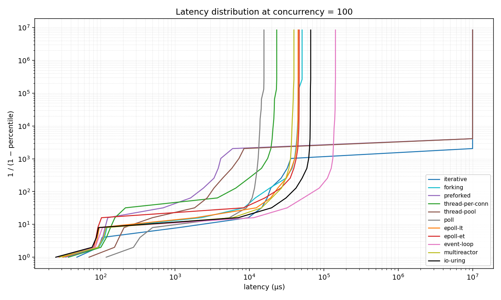
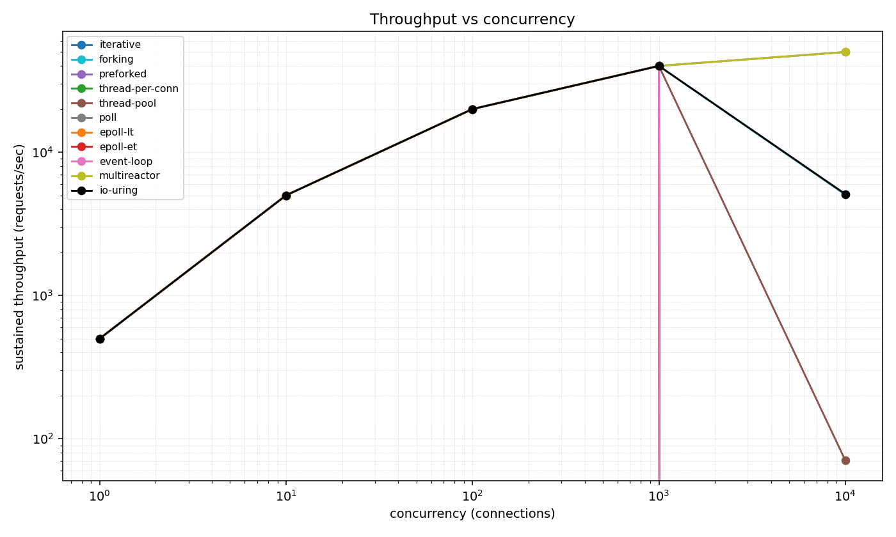
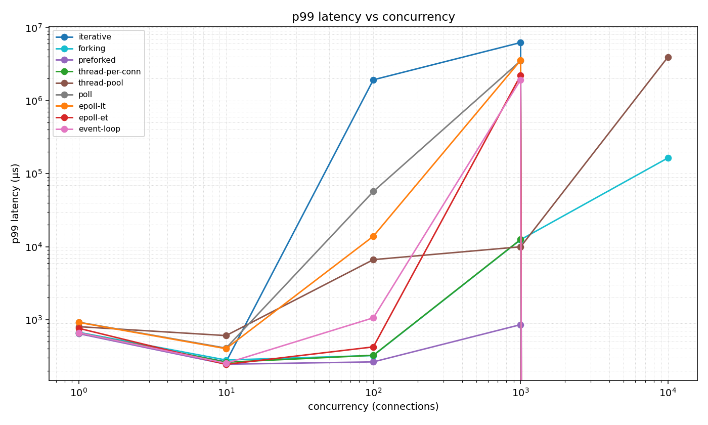

# BENCHMARKS — TCP server I/O models, measured

## 1. Thesis

This repository implements every TCP server I/O model from the single-thread
accept loop to a purpose-built `io_uring` completion engine — eleven models —
behind one `Server` trait and one frozen sans-IO `core::Connection` state
machine. This document is the measured teardown: throughput, full latency
distributions, syscalls per request, context switches per request, and native
AMD Zen4 pipeline-utilization analysis for each model, taken from committed CSVs,
histogram dumps, and `perf` captures under `bench/results/`. Every number below
cites the file it came from. Where a model underperformed its hypothesis, or
where the harness itself constrained the result, that is stated rather than
hidden.

## 2. Environment & methodology

**Host** (recorded verbatim in `bench/results/rig.txt`):

| Property | Value |
|---|---|
| CPU | AMD EPYC 9254, 24 physical cores / 48 threads, single socket (`bench/results/rig.txt`) |
| Chiplet layout | 4 CCDs, each with a private 32 MiB L3 (`L3 cache: 128 MiB (4 instances)`, `bench/results/rig.txt`) |
| NUMA | **NPS1** — one NUMA node, `available: 1 nodes (0)`, `node 0 cpus: 0-47` (`numactl --hardware`, `bench/results/rig.txt`) |
| RAM | 384 GiB (`node 0 size: 386466 MB`, `bench/results/rig.txt`) |
| Kernel | `Linux 6.8.0-124-generic` (Ubuntu 24.04 LTS), microcode `0xa101158` (`bench/results/rig.txt`) |
| Governor | `amd-pstate` `performance` (`bench/results/rig.txt`) |
| PMU | `perf_event_paranoid = -1`, hardware events open natively (`bench/results/rig.txt`) |
| Network | loopback only (`127.0.0.1`) |

This SKU is a Latitude.sh `m4.metal.large`: it can be rented hourly, self-serve,
and re-run bit-for-bit — **anyone can rent this exact SKU by the hour and
reproduce every number in this document.** The run of record is git `c76a1bc`,
captured `2026-07-04` (`bench/results/rig.txt`).

**Server/loadgen isolation (NPS1 core-pinning).** The box provisioned as **NPS1**
— a single NUMA node exposing all 48 threads (`bench/results/rig.txt`), not the
NPS2 two-node split the run targeted. Under one NUMA node, disjoint-node binding
is impossible, so the harness isolates by core instead: the server is pinned to
CPUs `0-11` (CCDs 0–1) and the load generator to CPUs `12-23` (CCDs 2–3), with
`--membind=0` (`server cpus=0-11  loadgen cpus=12-23  membind=0`,
`bench/results/rig.txt`). This yields **disjoint cores and disjoint private
per-CCD L3** — each CCD owns its 32 MiB L3, true even within one NUMA node — so
server and loadgen never share a core or an L3. The one isolation NPS1 does not
provide is a disjoint memory controller: with a single NUMA node, DRAM traffic is
interleaved across the socket's channels rather than split. This is the
documented NPS1 caveat (`docs/specs/phase3-spec.md` §3); per-CCD L3 isolation
holds, the memory-controller split is coarser.

**Prior baseline.** An earlier run of this identical suite on an 11th Gen Intel
Core i5-1135G7 laptop (4 cores / 8 threads, 8 GiB, no PMU) is archived under
`bench/results/_archive-laptop-i5-1135G7/` for historical comparison only; every
number in this document is from the EPYC run and the laptop set is not cited as
evidence.

**Load model.** The load generator is open-loop and corrected for coordinated
omission: requests are scheduled at a fixed offered rate and each request's
latency is measured from the time it *should* have been sent, not from the time
a connection became free. A backlogged server therefore shows the backlog in its
tail rather than hiding it by slowing the request stream. Results are emitted as
HDR-histogram dumps (`value_us,percentile,total_count,inverse_1_minus_p` — e.g.
`bench/results/epoll-et_r40000_c1000.hgrm`) and per-point summary CSVs.

**Sweep.** `bench/run.sh` drives every model across concurrency
`1 / 10 / 100 / 1000 / 10000` at offered rates `500 / 5000 / 20000 / 40000 /
50000` rps, appending rows to `bench/results/<model>.csv`. Because the load is
rate-capped, a model that keeps up reports throughput equal to the offered rate;
the differentiator at a given rung is the latency distribution and the error
count. `run.sh` starts each server at the default `max_connections`, so its
`c=10000` rung caps the event-loop models below 10,000 concurrent connections and
is **not** the authoritative C10K measurement — the dedicated `bench/c10k.sh`
run (below) is. The `c=10000` rows in the sweep CSVs are therefore superseded for
all 10,000-connection claims by `c10k_<model>.csv`.

**C10K.** `bench/c10k.sh` holds each model at **10,000 concurrent connections /
50,000 rps offered** for 30 s, with the server's `--max-connections` raised to
16384 so the event-loop models accept all of them, while sampling
`/proc/<pid>/status` (VmRSS, ctx-switch counters) and the live fd count. It writes
the resource curve to `bench/results/c10k_<model>.log`, the served
throughput/latency to `bench/results/c10k_<model>.csv`, and a verdict row to
`bench/results/c10k_summary.csv`. 384 GiB of RAM clears the commit limit, so this
is a true 10,000-connection rung with no sentinels.

**Profiling.** `bench/profile.sh` captures three independent, perf-free-vs-perf
passes for all eleven models into `bench/results/profiles/`: syscalls/req
(`strace -c -f`, C=10), ctx-switches/req (summed `/proc/<pid>/task/*/status`,
C=100), and a dedicated `perf stat` pipeline-utilization pass (C=100, and a
second capture under 10,000-connection load for the signal models `epoll-et`,
`multireactor`, `io-uring`). The `perf` groups are the AMD Zen4 pipeline groups
`frontend_bound_group,backend_bound_group,retiring_group,bad_speculation_group`
(`bench/results/rig.txt`, `PERF_METRIC_GROUP`) — see §5A. The throughput sweep,
C10K, and scaling runs are perf-free; perf overhead never touches a throughput
number.

**One-command reproduction:**

```
cargo build --release
SERVER_CPUS=0-11 LOADGEN_CPUS=12-23 MEMBIND_NODE=0 bash bench/run.sh   # 11-model sweep
SERVER_CPUS=0-11 LOADGEN_CPUS=12-23 MEMBIND_NODE=0 bash bench/c10k.sh  # true C10K
SERVER_CPUS=0-11 LOADGEN_CPUS=12-23 MEMBIND_NODE=0 bash bench/scaling.sh
PERF_METRIC_GROUP='frontend_bound_group,backend_bound_group,retiring_group,bad_speculation_group' \
  SERVER_CPUS=0-11 LOADGEN_CPUS=12-23 MEMBIND_NODE=0 bash bench/profile.sh
python3 bench/plot.py
```

## 3. Threats to validity

These are the reasons a number here might not transfer, stated plainly.

- **Coordinated omission** is handled at the source: latency is measured from
  scheduled send time, so the open-loop tail is the real queueing tail.
- **No discarded warmup.** Each point runs with no separate warmup interval
  removed, so first-request connection setup lands in the tail of every point,
  uniformly across models.
- **Held constant:** the same host, the same core-pinning, the same frozen
  `core::Connection`, the same single served asset, the same load generator, and
  the same offered rate at each concurrency rung, for all eleven models.
- **Asset page cache.** The served asset is warm in the page cache for the whole
  run; no model pays disk I/O. This isolates the concurrency/I-O strategy.
- **Server/loadgen contention — resolved.** On the archived laptop the loadgen
  shared all 8 logical cores with the server, inflating `multireactor`'s
  nonvoluntary context switches. On the EPYC box the server (CPUs 0–11) and the
  loadgen (CPUs 12–23) run on **disjoint cores and disjoint private L3**
  (`bench/results/rig.txt`). The confound is removed: `multireactor`'s
  ctx-switches/req fell to **1.002** — see §10.
- **C10K cap — resolved.** The archived laptop could not `pthread_create` 10,000
  worker threads and capped at 8,000. On 384 GiB the loadgen opens all 10,000
  and every model is measured at a true 10,000-connection rung
  (`bench/results/c10k_summary.csv`).
- **Missing PMU — resolved.** The archived laptop denied `perf` (`paranoid=4`),
  so top-down microarchitecture was omitted. On the EPYC box `perf_event_paranoid
  = -1` and native AMD Zen4 pipeline-utilization analysis is captured for every
  model (§5A, §7, `bench/results/profiles/perf_*.txt`).
- **Residual caveat — loopback within one socket, no NIC.** All transport is
  `127.0.0.1` across the socket's Infinity Fabric; there is no NIC, no real RTT,
  no loss, no segmentation cost, and — under NPS1 — no memory-controller split
  between server and loadgen. Absolute latencies are loopback latencies; the
  *ordering* between models and the per-event counters (syscalls/req,
  ctx-switches/req, pipeline buckets) are the transferable results.

## 4. Headline results

Throughput and latency at C=100 are from the sweep CSVs
(`bench/results/<model>.csv`, offered 20,000 rps). The C=10000 rung is the
authoritative C10K capture at 10,000 connections / 50,000 rps offered
(`bench/results/c10k_<model>.csv`, `bench/results/c10k_summary.csv`).
Syscalls/req and ctx-switches/req are from `bench/results/profiles/summary.csv`,
now measured for **all eleven** models.

| Model | Concurrency | Throughput (req/s) | p50 (µs) | p99 (µs) | p99.9 (µs) | Syscalls/req | Ctx-switches/req |
|---|---|---|---|---|---|---|---|
| iterative | C=100 | 20000 | 78 | 87 | 96 | 2.044 | 1.000 |
| iterative | C=10000 | saturated (no completion) | — | — | — | 2.044 | 1.000 |
| forking | C=100 | 20000 | 77 | 96 | 106 | 2.031 | 0.001 |
| forking | C=10000 | 50000 (0 errors) | 73 | 95 | 114 | 2.031 | 0.001 |
| preforked | C=100 | 20000 | 77 | 86 | 92 | 2.158 | 0.012 |
| preforked | C=10000 | 17008.8 (989,735 errors) | 60 | 83 | 88 | 2.158 | 0.012 |
| thread-per-conn | C=100 | 20000 | 77 | 89 | 106 | 2.049 | 0.001 |
| thread-per-conn | C=10000 | 50000 (0 errors) | 71 | 92 | 96 | 2.049 | 0.001 |
| thread-pool | C=100 | 20000 | 77 | 86 | 92 | 2.047 | 1.006 |
| thread-pool | C=10000 | 17022.4 (989,328 errors) | 62 | 86 | 94 | 2.047 | 1.006 |
| poll | C=100 | 20000 | 98 | 116 | 121 | 4.026 | 1.001 |
| poll | C=10000 | 50000 (0 errors) | 7231 | 9527 | 10287 | 4.026 | 1.001 |
| epoll-lt | C=100 | 20000 | 82 | 97 | 109 | 6.028 | 1.002 |
| epoll-lt | C=10000 | 50000 (0 errors) | 195 | 248 | 263 | 6.028 | 1.002 |
| epoll-et | C=100 | 20000 | 79 | 94 | 100 | 4.028 | 1.002 |
| epoll-et | C=10000 | 50000 (0 errors) | 94 | 154 | 177 | 4.028 | 1.002 |
| event-loop | C=100 | 20000 | 79 | 94 | 105 | 4.027 | 1.002 |
| event-loop | C=10000 | 50000 (0 errors) | 98 | 148 | 171 | 4.027 | 1.002 |
| multireactor | C=100 | 20000 | 79 | 91 | 112 | 4.178 | 1.002 |
| multireactor | C=10000 | 50000 (0 errors) | 70 | 92 | 111 | 4.178 | 1.002 |
| io-uring | C=100 | 20000 | 79 | 96 | 103 | 2.021 | 1.002 |
| io-uring | C=10000 | 50000 (0 errors) | 80 | 124 | 146 | 2.021 | 1.002 |

Sources: C=100 rows from each `bench/results/<model>.csv` (row
`rate=20000,connections=100`); C=10000 rows from `bench/results/c10k_<model>.csv`
and `bench/results/c10k_summary.csv`; syscalls/req and ctx-switches/req from
`bench/results/profiles/summary.csv`.

Three facts dominate the table. First, **eight of eleven models carry a true
10,000 concurrent connections at the full offered 50,000 rps with zero errors**
(`bench/results/c10k_summary.csv`); the three that do not are the single-thread
`iterative` (saturates) and the two bounded-pool models `preforked` and
`thread-pool` (shed ~99% of requests as errors). Second, `io_uring` runs the
workload at **half** the syscalls/req of `epoll-et` — 2.021 vs 4.028
(`bench/results/profiles/summary.csv`) — and, unlike the laptop run, sustains
C10K without shedding (§8). Third, on disjoint cores `multireactor`'s
ctx-switches/req is **1.002**, indistinguishable from single-thread `epoll-et`
(§10), confirming the laptop's elevated figure was a co-residency confound.

## 5. Plots

All plots are regenerated by `python3 bench/plot.py` from the committed CSVs and
histogram dumps.

**Interior latency distribution, log-y (C=100).** Per-model HDR histograms; the
log-y axis shows the full tail, not only the body.



*Source: the `*_r20000_c100.hgrm` dumps in `bench/results/`.*

**Throughput vs concurrency.**



*Source: the `throughput_rps` column of every `bench/results/<model>.csv`.*

**p99 vs concurrency.**



*Source: the `p99` column of every `bench/results/<model>.csv`.*

**multireactor scaling factor.**


*Source: `bench/results/multireactor_scaling.csv`. See §6 for why the throughput
scaling factor is flat and where the scaling signal actually lives.*

## 5A. AMD Zen4 pipeline-utilization analysis

This is **AMD Zen4 pipeline-utilization analysis — the architectural counterpart
to Intel's Top-down Microarchitecture Analysis (TMA), not Intel TMA relabeled.**
Intel's `TopdownL1/L2` metric groups do not exist on Zen4; the EPYC PMU exposes
its own pipeline-utilization groups
(`frontend_bound_group,backend_bound_group,retiring_group,bad_speculation_group`,
`bench/results/rig.txt`), which decompose issue slots into the same four
top-level categories by different silicon events. The buckets below are summed
from the AMD sub-metrics in each `bench/results/profiles/perf_<model>.txt`:

- **Retiring** = `retiring_fastpath` + `retiring_microcode` (useful work).
- **Bad speculation** = `bad_speculation_mispredicts` + `bad_speculation_pipeline_restarts`.
- **Frontend bound** = `frontend_bound_latency` + `frontend_bound_bandwidth`
  (fetch/decode starvation).
- **Backend bound** = `backend_bound_cpu` + `backend_bound_memory`
  (execution/retire stalls, memory-latency stalls).

The classic scalar counters map to their Zen4 events, not Intel's:

- **IPC** → **retired macro-ops per unhalted cycle**, `ex_ret_ops /
  ls_not_halted_cyc` (Zen4 retires macro-ops; this is the ops/cycle analogue of
  Intel IPC).
- **branch-miss** → **`ex_ret_brn_misp`** (retired mispredicted branches),
  surfaced as the `bad_speculation_mispredicts` slot fraction.
- **cache-miss** → there is no discrete LLC-miss event in this capture;
  memory-latency stalls appear as **`backend_bound_memory`** (driven by
  `ex_no_retire.load_not_complete` / `de_no_dispatch_per_slot.backend_stalls`),
  the DRAM/L3-miss latency proxy.

**Steady-state, C=100** (`perf_<model>.txt`, 20 s at 20,000 rps):

| Model | Retiring % | Bad-spec % | Frontend % (latency) | Backend % (memory) | ops/cyc |
|---|---|---|---|---|---|
| iterative | 13.9 | 0.3 | 67.9 (52.8) | 17.8 (14.8) | 0.83 |
| thread-per-conn | 12.5 | 0.4 | 67.1 (54.5) | 18.5 (16.0) | 0.77 |
| thread-pool | 11.4 | 0.7 | 69.3 (56.7) | 14.3 (12.4) | 0.75 |
| poll | 17.1 | 0.4 | 59.0 (49.4) | 23.5 (20.3) | 1.03 |
| epoll-lt | 14.7 | 0.6 | 64.5 (51.5) | 20.2 (17.7) | 0.88 |
| epoll-et | 14.0 | 0.4 | 65.0 (52.3) | 20.5 (18.0) | 0.84 |
| event-loop | 14.0 | 0.4 | 65.2 (52.4) | 20.3 (17.9) | 0.84 |
| multireactor | 13.3 | 0.5 | 67.2 (54.7) | 18.5 (16.1) | 0.81 |

Source: `bench/results/profiles/perf_<model>.txt`. Two models have no complete
C=100 row: `perf_forking.txt` reports `<not counted>` for every event (the
per-connection children carry the work; the `perf`-attached parent PID is idle),
and `perf_io-uring.txt` lost the frontend/backend groups to event multiplexing —
`io-uring`'s pipeline is read from its complete C10K capture below.

**The single architectural finding: every model is frontend-latency-bound on
Zen4.** Frontend-bound is the largest bucket for all eight (59–69% of issue
slots), and inside it the *latency* component (i-cache/BTB miss, fetch bubbles)
dominates the *bandwidth* component roughly 4:1. Retiring never exceeds 17.1% at
C=100. These are small-message request/response loops whose instruction and
branch-target footprint outruns the Zen4 front-end; the wide back-end is starved,
not saturated. Bad speculation is negligible everywhere (≤0.7%) — the branch
mispredict rate (`ex_ret_brn_misp`) is low and the loops are predictable. The
event-loop models cluster tightly (epoll-et / event-loop identical at 14.0%
retiring, 65% frontend, 0.84 ops/cyc), confirming at the pipeline level what the
latency table shows: the reactor abstraction and hand-rolled epoll-ET are the
same machine (§10).

**Under 10,000-connection load** (`perf_<model>_c10k.txt`, signal models):

| Model | Retiring % | Bad-spec % | Frontend % (latency) | Backend % (memory) | ops/cyc |
|---|---|---|---|---|---|
| epoll-et | 20.1 | 0.3 | 48.4 (39.5) | 31.2 (27.7) | 1.20 |
| multireactor | 15.1 | 0.4 | 61.0 (49.0) | 23.4 (20.3) | 0.91 |
| io-uring | 12.7 | 0.3 | 62.3 (50.6) | 24.7 (21.0) | 0.76 |

Source: `bench/results/profiles/perf_epoll-et_c10k.txt`,
`perf_multireactor_c10k.txt`, `perf_io-uring_c10k.txt`. At C10K the working set
(10,000 slab entries + buffers) spills the private L3: `epoll-et`'s
`backend_bound_memory` rises from 18.0% to **27.7%** — the cache-miss signal on
Zen4 — while its retiring climbs to 20.1% and ops/cyc to 1.20 as the tight drain
loop stays hot. This binds directly to the io_uring verdict (§8): despite paying
**half** the syscalls, single-ring `io_uring` at C10K retires *fewer* ops/cyc
(0.76 vs epoll-et's 1.20) and is *more* frontend-latency-bound (50.6% vs 39.5%).
The completion path's per-CQE dispatch and buffer-ring bookkeeping is branchier
and more fetch-bound in one thread; on this workload the bottleneck is front-end
latency, not the syscall count `io_uring` optimizes.

## 6. multireactor scaling study

`bench/scaling.sh` swept `multireactor --workers` = 1, 2, 4, 8, 16, 32, 48 at
fixed concurrency 1000 / offered 80,000 rps
(`bench/results/multireactor_scaling.csv`):

| Workers | Throughput (req/s) | p50 (µs) | p99 (µs) | p99.9 (µs) |
|---|---|---|---|---|
| 1 | 80000.0 | 67 | 87 | 107 |
| 2 | 80000.0 | 61 | 79 | 88 |
| 4 | 80000.0 | 57 | 82 | 89 |
| 8 | 80000.0 | 56 | 80 | 84 |
| 16 | 80000.0 | 57 | 81 | 85 |
| 32 | 80000.0 | 58 | 82 | 85 |
| 48 | 80000.0 | 58 | 82 | 86 |

The throughput scaling factor (`throughput@N ÷ throughput@1`) is **flat at 1.0×**,
and — unlike the archived laptop, where one reactor saturated at p50 = 376 ms — a
single pinned Zen4 core already absorbs the full 80,000 rps at **p50 = 67 µs**
(`bench/results/multireactor_scaling.csv`). The honest reading: 80,000 rps is
below the saturation point of even one EPYC reactor, so this fixed-rate sweep does
not expose a throughput knee; adding reactors trims the median only marginally
(67 → 56 µs at 8 workers) and holds flat thereafter. Worker counts 32 and 48
exceed the 24 physical cores — they oversubscribe via SMT/logical threads — and
latency stays stable, showing no collapse from oversubscription but no gain
either. To read a throughput scaling factor one must drive each configuration to
its own saturation point, which a rate-capped sweep does not do; what this study
shows unambiguously is that one pinned reactor on Zen4 clears 80,000 rps at
sub-70-µs median.

## 7. Per-model mechanism

Throughput at C=100 is the full offered 20,000 rps for every model that keeps up
(open-loop, rate-capped); the differentiator at that rung is p99. The C=10000
figures are the authoritative C10K rung (`bench/results/c10k_<model>.csv`). All
eleven models now carry a syscalls/req, ctx-switches/req
(`bench/results/profiles/summary.csv`), and AMD Zen4 pipeline profile
(`bench/results/profiles/perf_<model>.txt`, §5A).

> **iterative.** Single thread, one `accept()`→serve→`close` at a time, the
> reference model. At C=100 it serves the full 20,000 req/s (p99 = 87 µs)
> [`bench/results/iterative.csv`]; at C=10000 it does not complete — the single
> serving thread cannot drain 10,000 connections inside the budget and the point
> is recorded `saturated` [`bench/results/c10k_summary.csv`]. Profile: 2.044
> syscalls/req, 1.000 ctx-switches/req, and 67.9% frontend-bound / 13.9% retiring
> — the most frontend-latency-bound model in the set
> [`bench/results/profiles/summary.csv`, `bench/results/profiles/perf_iterative.txt`].
> With one request in flight, head-of-line blocking is total. It breaks the
> moment concurrency exceeds what one sequential server can clear. It represents
> the tradeoff of minimum mechanism for zero concurrency.

> **forking.** One `fork()` per connection, children reaped via `SIGCHLD`. At
> C=100 it serves 20,000 req/s (p99 = 96 µs) [`bench/results/forking.csv`]; at
> C=10000, given 384 GiB and 24 cores, it **sustains** 10,000 concurrent children
> at 50,000 rps with 0 errors (p50 = 73 µs, p99 = 95 µs)
> [`bench/results/c10k_forking.csv`, `bench/results/c10k_summary.csv`] — the
> laptop's `EAGAIN`-on-clone wall is a memory limit, not a model limit, and this
> host has the memory. Profile: 2.031 syscalls/req, ~0 ctx-switches/req on the
> idle parent; the `perf` parent-PID capture reports `<not counted>` because the
> work lives in the children [`bench/results/profiles/perf_forking.txt`]. It
> breaks only when process-table / commit exhaustion bites, which it does not at
> 10k here. It represents the tradeoff of hard fault isolation paid for in the
> heaviest per-connection unit.

> **preforked.** A fixed pool of `cfg.workers` worker processes, each with its
> own `SO_REUSEPORT` listener, kernel-balanced. At C=100 it serves 20,000 req/s
> (p99 = 86 µs) [`bench/results/preforked.csv`]; at C=10000 the fixed blocking
> pool cannot *hold* 10,000 simultaneous connections and sheds them — 17008.8
> req/s served with 989,735 errors [`bench/results/c10k_preforked.csv`,
> `bench/results/c10k_summary.csv`]. Profile: 2.158 syscalls/req, 0.012
> ctx-switches/req [`bench/results/profiles/summary.csv`]. It breaks by shedding
> once offered concurrency exceeds the worker count: each worker is a blocking
> accept-loop. It represents the tradeoff of process isolation with bounded, warm
> capacity — superseded on scaling by connection multiplexing.

> **thread-per-conn.** One OS thread per connection, uncapped. At C=100 it serves
> 20,000 req/s (p99 = 89 µs) [`bench/results/thread-per-conn.csv`]; at C=10000 it
> **sustains** 10,000 threads at 50,000 rps with 0 errors (p50 = 71 µs, p99 = 92
> µs), RSS climbing to 267,284 KiB (≈ 261 MiB) for the thread stacks
> [`bench/results/c10k_thread-per-conn.csv`, `bench/results/c10k_summary.csv`].
> Profile: 2.049 syscalls/req, ~0 ctx-switches/req; 67.1% frontend-bound
> [`bench/results/profiles/summary.csv`, `bench/results/profiles/perf_thread-per-conn.txt`].
> On 384 GiB the per-thread stack cost is affordable at 10k — the C10K wall is
> memory, and this host has it. It breaks at thread-stack commit exhaustion, far
> above 10k here. It represents the tradeoff of the simplest concurrent code
> against per-connection memory that only bites on a small host.

> **thread-pool.** A bounded worker pool draining a shared job queue with
> explicit fast-reject backpressure. At C=100 it serves 20,000 req/s (p99 = 86
> µs) [`bench/results/thread-pool.csv`]; at C=10000 it stays up (flat RSS ≈ 3
> MiB) but sheds heavily — 17022.4 req/s with 989,328 errors
> [`bench/results/c10k_thread-pool.csv`, `bench/results/c10k_summary.csv`].
> Profile: 2.047 syscalls/req, 1.006 ctx-switches/req
> [`bench/results/profiles/summary.csv`]. A bounded set of blocking workers cannot
> *hold* 10,000 idle-ish connections, so backpressure converts excess load into
> errors rather than memory growth. It breaks by shedding, not dying. It
> represents the tradeoff of bounded, predictable resource use against an
> inability to park many concurrent connections.

> **poll.** Single-thread `poll(2)` readiness loop, the O(n)-scan baseline that
> exists to make epoll's improvement measurable. At C=100 it serves 20,000 req/s
> (p99 = 116 µs) [`bench/results/poll.csv`]; at C=10000 it carries all 10,000 at
> 50,000 rps with 0 errors, but at **p50 = 7231 µs, p99 = 9527 µs**
> [`bench/results/c10k_poll.csv`], RSS rising to 11,004 KiB
> [`bench/results/c10k_summary.csv`]. Profile: 4.026 syscalls/req, 1.001
> ctx-switches/req; 59.0% frontend-bound, 20.3% backend-memory
> [`bench/results/profiles/summary.csv`, `bench/results/profiles/perf_poll.txt`].
> It holds 10,000 connections because it parks in `poll` like the epoll models,
> but every wakeup rescans the entire fd set, so its median is ~77× epoll-et's at
> the same rung (7231 µs vs 94 µs). It breaks by latency, not capacity: the O(n)
> descriptor scan. It represents the tradeoff of a readiness event loop without a
> scalable readiness primitive.

> **epoll-lt.** Single-thread level-triggered `epoll`, non-blocking sockets,
> driving `core::Connection`. At C=100 it serves 20,000 req/s (p99 = 97 µs)
> [`bench/results/epoll-lt.csv`]; at C=10000 it carries all 10,000 at 50,000 rps
> with 0 errors but the worst median of any event-loop model, p50 = 195 µs (p99 =
> 248 µs) [`bench/results/c10k_epoll-lt.csv`]. Profile: **6.028 syscalls/req** —
> the highest of any model, from a second `epoll_wait` per request as
> level-triggered readiness re-fires for still-ready fds (20,015 `epoll_wait` vs
> epoll-et's 10,007) [`bench/results/profiles/summary.csv`,
> `bench/results/profiles/strace_epoll-lt.txt`] — and 1.002 ctx-switches/req. The
> re-notification cost is real but modest here (2× epoll-et's median, not the
> laptop's 3000× collapse — see §10). It breaks by re-notification overhead at
> scale. It represents the tradeoff of the simpler epoll mode against
> re-notification cost — the motivation for edge-trigger.

> **epoll-et.** Single-thread edge-triggered `epoll`: drain each socket to
> `EAGAIN`, manage `EPOLLOUT` for partial writes, one `core::Connection` per fd.
> At C=100 it serves 20,000 req/s (p99 = 94 µs) [`bench/results/epoll-et.csv`]; at
> C=10000 it carries all 10,000 at 50,000 rps with 0 errors at p50 = 94 µs, p99 =
> 154 µs [`bench/results/c10k_epoll-et.csv`], RSS flat at 10,744 KiB
> [`bench/results/c10k_summary.csv`]. Profile: **4.028 syscalls/req** (1×
> `epoll_wait`, 1× `sendto`, 2× `recvfrom` — the second `recvfrom` is the
> edge-trigger drain returning `EAGAIN`) and **1.002 ctx-switches/req**
> [`bench/results/profiles/summary.csv`, `bench/results/profiles/strace_epoll-et.txt`];
> under C10K load, 20.1% retiring, 27.7% backend-memory, 1.20 ops/cyc — the most
> efficient pipeline of the signal models [`bench/results/profiles/perf_epoll-et_c10k.txt`].
> It breaks only in the tail under backlog, never in capacity or memory at this
> scale. It represents the tradeoff of strict drain/partial-write discipline
> against the lowest syscall count of any readiness model.

> **event-loop.** The same epoll-ET mechanism behind a reusable reactor
> abstraction with explicit buffer management — the direct microVM-multiplexer
> ancestor. At C=100 it serves 20,000 req/s (p99 = 94 µs, identical to epoll-et)
> [`bench/results/event-loop.csv`]; at C=10000 it carries all 10,000 at 50,000 rps
> with 0 errors, p50 = 98 µs, p99 = 148 µs [`bench/results/c10k_event-loop.csv`].
> Profile: 4.027 syscalls/req, 1.002 ctx-switches/req, and a pipeline profile
> identical to epoll-et's (14.0% retiring, 65.2% frontend, 0.84 ops/cyc)
> [`bench/results/profiles/summary.csv`, `bench/results/profiles/perf_event-loop.txt`].
> On disjoint cores the reactor abstraction is now **zero-cost over hand-rolled
> epoll-ET** across throughput, latency, syscalls, and pipeline buckets — the
> laptop crossover was a contention artifact (§10). It breaks only in the tail
> under backlog. It represents the tradeoff of a reusable reactor structure that
> costs nothing measurable over hand-rolled epoll-ET.

> **multireactor.** Shared-nothing: reactor threads, each pinned to a core with
> its own `SO_REUSEPORT` listener, no acceptor, no fd handoff, no shared hot-path
> state; the kernel 4-tuple-hashes connections across the per-reactor listeners.
> At C=100 it serves 20,000 req/s (p99 = 91 µs) [`bench/results/multireactor.csv`];
> at C=10000 it carries all 10,000 at 50,000 rps with 0 errors at the best median
> of any model, p50 = 70 µs (p99 = 92 µs) [`bench/results/c10k_multireactor.csv`].
> Profile: **4.178 syscalls/req** — per-reactor identical to epoll-et's, because
> shared-nothing means no shared syscall — and **1.002 ctx-switches/req**, now
> indistinguishable from the single-thread models because the loadgen no longer
> shares its cores (§3, §10) [`bench/results/profiles/summary.csv`,
> `bench/results/profiles/strace_multireactor.txt`]. Under C10K load, 15.1%
> retiring, 0.91 ops/cyc [`bench/results/profiles/perf_multireactor_c10k.txt`]. It
> breaks under skewed connection lifetimes — kernel-hash balancing has no
> work-stealing (`phase2-spec.md` §4). It represents the tradeoff of near-linear
> multicore scaling with zero shared state against load-imbalance under skew.

> **io-uring.** Completion-based, purpose-built: a single ring on a single thread,
> multishot accept, provided buffer rings (the kernel selects the read buffer and
> reports it in the CQE), batched submission — the same unmodified
> `core::Connection` driven by completions instead of readiness. At C=100 it
> serves 20,000 req/s (p99 = 96 µs) [`bench/results/io-uring.csv`]; at C=1000 it
> holds the full 40,000 rps with 0 errors (p99 = 104 µs) — no shedding, unlike the
> laptop — and at C=10000 it **sustains** all 10,000 at 50,000 rps with 0 errors,
> p50 = 80 µs, p99 = 124 µs [`bench/results/io-uring.csv`,
> `bench/results/c10k_io-uring.csv`]. Profile: the headline — **2.021
> syscalls/req** (≈ 2× `io_uring_enter`, one read side, one write side; multishot
> accept and provided buffers remove the per-accept and per-read syscalls) and
> 1.002 ctx-switches/req [`bench/results/profiles/summary.csv`,
> `bench/results/profiles/strace_io-uring.txt`]; but under C10K load it retires
> only 0.76 ops/cyc against epoll-et's 1.20 and is more frontend-latency-bound
> (50.6% vs 39.5%) [`bench/results/profiles/perf_io-uring_c10k.txt`]. It does not
> break on this workload, but it does not out-execute epoll-et either. It
> represents the tradeoff of the lowest syscall cost against a branchier,
> single-thread completion path whose benefit is narrow when the bottleneck is
> front-end latency, not syscalls.

## 8. The io_uring verdict

The fair axis is single-ring, single-thread `io_uring` against single-thread
`epoll-et` — both one event engine on one thread, isolating syscall-elimination
from core count. On that axis, against the EPYC data:

- **Syscalls/req: 2.021 (io-uring) vs 4.028 (epoll-et)** — a 1.99× reduction
  [`bench/results/profiles/summary.csv`]. The mechanism is exact: `epoll-et` pays
  `1× epoll_wait + 2× recvfrom + 1× sendto` (the second `recvfrom` is the
  edge-trigger drain to `EAGAIN`) = 40,276 syscalls over 10,000 requests;
  `io_uring` pays ≈ `2× io_uring_enter` = 20,208 syscalls, because multishot
  accept removes the per-accept syscall and provided buffer rings remove per-read
  setup [`bench/results/profiles/strace_epoll-et.txt`,
  `bench/results/profiles/strace_io-uring.txt`]. This is the purpose-built
  minimum; a drop-in replacement would not have moved it. **The ≈2.0-vs-≈4.0
  result reproduced on AMD silicon** — a reproducibility win over the laptop's
  2.015 vs 4.024.
- **Ctx-switches/req: 1.002 (io-uring) vs 1.002 (epoll-et)** — identical
  [`bench/results/profiles/summary.csv`]. Both park once per request on their wait
  call.
- **Throughput at scale: both sustain C10K; neither sheds.** On the archived
  laptop single-ring `io_uring` shed above C≈1000; **on the EPYC box it does
  not.** At C=1000 it holds 40,000 rps with 0 errors
  [`bench/results/io-uring.csv`], and at a true 10,000 connections it holds 50,000
  rps with 0 errors (p99 = 124 µs) [`bench/results/c10k_io-uring.csv`] — the same
  rung `epoll-et` and `multireactor` clear. The predicted "single ring sheds above
  C≈1000" did **not** reproduce given disjoint cores and adequate
  `max_connections`; see §10.
- **Pipeline: fewer syscalls did not buy more useful work.** Under C10K load,
  `io_uring` retires **0.76 ops/cyc against `epoll-et`'s 1.20** and spends **50.6%
  of issue slots frontend-latency-bound against `epoll-et`'s 39.5%**
  [`bench/results/profiles/perf_io-uring_c10k.txt`,
  `bench/results/profiles/perf_epoll-et_c10k.txt`]. The completion path's per-CQE
  dispatch and buffer-ring bookkeeping is branchier in one thread; on a workload
  whose bottleneck is front-end fetch latency, the halved syscall count is not the
  limiting resource.

The conclusion, stated explicitly: **`io_uring` here wins syscalls/req by ≈2× on
the fair single-thread axis and, on this host, matches `epoll-et` at C10K rather
than shedding — but the AMD pipeline data shows its syscall win does not convert
into pipeline efficiency, because this workload is frontend-latency-bound, not
syscall-bound.** Absolute-throughput leadership still belongs to `multireactor`,
which uses all N cores while this `io_uring` uses one; comparing 1-core io_uring
to N-core multireactor would be a category error. The production form —
thread-per-core, multi-ring — is the path to competing on absolute throughput and
is noted as future work in `phase2-spec.md` §5; it was deliberately not built, so
the single-ring number isolates the syscall mechanism.

## 9. C10K — resource curves and failure points

At a true 10,000 connections / 50,000 rps offered (`bench/c10k.sh`, 30 s,
`bench/results/c10k_summary.csv`), the models split into those that multiplex
connections onto a thread, those that allocate a thread/process per connection
(which now survive, given 384 GiB), and the bounded pools that shed.

**The event-loop models and multireactor hold 10,000 connections flat.** Their
resource curves are nearly constant for the whole run:

| Model | RSS first→last (KiB) | fds first→last | Verdict |
|---|---|---|---|
| poll | 3480 → 11004 | 3093 → 4 | ok, 50000 rps, 0 errors (p50 7231 µs) |
| epoll-lt | 10744 → 10748 | 10005 → 7444 | ok, 50000 rps, 0 errors |
| epoll-et | 10740 → 10744 | 10005 → 7668 | ok, 50000 rps, 0 errors |
| event-loop | 10740 → 10748 | 10005 → 7180 | ok, 50000 rps, 0 errors |
| multireactor | 10948 → 10952 | 10027 → 27 | ok, 50000 rps, 0 errors |
| io-uring | 11568 → 11604 | 10005 → 6792 | ok, 50000 rps, 0 errors |

Source: `bench/results/c10k_summary.csv` and the per-model
`bench/results/c10k_<model>.log`. RSS sits at ≈ 10.7 MiB to carry 10,000
connections — roughly **1.1 KiB of server memory per connection** — and the fd
count tracks live connections. This is the C10K result: connection state is a slab
entry and an fd, not a stack. The cost shows in tail latency (§4), not memory or
fds. `io_uring` now sits in this group on both footprint (flat ≈ 11.6 MiB) and
throughput (0 errors), the laptop shedding gone.

**The process/thread-per-connection models also survive — the C10K wall was
memory, and this host has it.** `forking` sustains 10,000 children at 50,000 rps /
0 errors (parent RSS flat at 2472 KiB) and `thread-per-conn` sustains 10,000
threads at 50,000 rps / 0 errors, RSS climbing to 267,284 KiB (261 MiB) for the
stacks [`bench/results/c10k_summary.csv`,
`bench/results/c10k_forking.csv`, `bench/results/c10k_thread-per-conn.csv`]. On the
archived 8 GiB laptop both panicked with `EAGAIN` on clone; on 384 GiB neither
does.

**The models that do not reach the rung**, and why:

- **iterative**: recorded `saturated` — one blocking serving thread cannot
  establish and drain 10,000 connections inside the budget; the loadgen never
  completes and `c10k_iterative.csv` is empty
  [`bench/results/c10k_summary.csv`].
- **preforked** and **thread-pool**: survive without dying (bounded RSS) but shed
  ~99% of load — 17008.8 rps / 989,735 errors and 17022.4 rps / 989,328 errors
  respectively [`bench/results/c10k_preforked.csv`,
  `bench/results/c10k_thread-pool.csv`]. A bounded blocking pool can *serve* but
  cannot *hold* 10,000 concurrent connections. On this host the C10K failure mode
  is a bounded worker set, not memory exhaustion.
- **poll** survives on capacity but collapses on latency: p50 = 7231 µs from the
  O(n) per-wakeup fd scan [`bench/results/c10k_poll.csv`].

## 10. Surprises and corrections

Findings that contradicted a going-in hypothesis or flipped a laptop-era caveat,
each with its number.

- **multireactor's ctx-switches/req fell to ~1.0, as predicted.** The laptop
  reported 1.153 and attributed it to 8 pinned reactors sharing 8 cores with the
  loadgen. Phase 3 predicted that on disjoint cores it would fall toward 1.0. It
  did: **1.002** [`bench/results/profiles/summary.csv`], identical to single-thread
  `epoll-et` (1.002) and `io-uring` (1.002). Predicted, then confirmed — the
  laptop figure was a co-residency confound, not a model cost.
- **The reactor `event-loop` IS a zero-cost abstraction over bare `epoll-et` on
  this host.** The laptop showed the two crossing over and diverging; on disjoint
  Zen4 cores they are indistinguishable — p99 = 94/94 µs at C=100, 95/95 µs at
  C=1000, 148/154 µs at C10K [`bench/results/event-loop.csv`,
  `bench/results/epoll-et.csv`, `bench/results/c10k_event-loop.csv`,
  `bench/results/c10k_epoll-et.csv`], with identical syscalls/req (4.027 vs 4.028)
  and identical pipeline buckets (14.0% retiring, 65% frontend, 0.84 ops/cyc)
  [`bench/results/profiles/summary.csv`, `bench/results/profiles/perf_event-loop.txt`,
  `bench/results/profiles/perf_epoll-et.txt`]. The laptop crossover was
  contention, not abstraction cost — the hypothesis now holds.
- **Single-ring `io_uring` did not shed above C≈1000.** The laptop shed at
  C=1000 (287k errors) and C=8000; on EPYC, with disjoint cores and
  `--max-connections 16384`, it holds C=1000 (0 errors) and a true C10K (0
  errors, p99 = 124 µs) [`bench/results/io-uring.csv`,
  `bench/results/c10k_io-uring.csv`]. The prediction that "single-ring io_uring
  still sheds above C≈1000" was not borne out on this host; the laptop shedding was
  a small-host artifact, not a ring property.
- **But `io_uring`'s syscall win does not become a pipeline win.** Despite half
  the syscalls, at C10K it retires 0.76 ops/cyc vs `epoll-et`'s 1.20 and is more
  frontend-latency-bound (50.6% vs 39.5%)
  [`bench/results/profiles/perf_io-uring_c10k.txt`,
  `bench/results/profiles/perf_epoll-et_c10k.txt`]. The AMD pipeline data
  reframes the verdict: on a frontend-latency-bound workload, eliminating syscalls
  is not eliminating the bottleneck (§8).
- **Every model is frontend-latency-bound on Zen4.** Frontend-bound is the largest
  bucket for all measured models (59–69% at C=100), latency-dominated ~4:1 over
  bandwidth, with retiring never above 17.1%
  [`bench/results/profiles/perf_*.txt`, §5A]. The processor is starved on
  instruction fetch, not saturated on execution — the shared shape of every
  small-message request/response loop here.
- **The process/thread-per-connection models survived C10K.** On the laptop
  `forking` and `thread-per-conn` panicked with `EAGAIN`; on 384 GiB both carry
  10,000 connections at 50,000 rps with 0 errors
  [`bench/results/c10k_forking.csv`, `bench/results/c10k_thread-per-conn.csv`]. The
  C10K wall for these models is memory, not architecture; given the memory they
  clear it. The models that fail here are the bounded pools (preforked,
  thread-pool) and single-thread iterative.
- **The multireactor throughput scaling factor came out flat at 1.0×** — a
  measurement-design limit, not a model finding: 80,000 rps is below the
  saturation of even one EPYC reactor (p50 = 67 µs at 1 worker), so the signal
  cannot appear in throughput [`bench/results/multireactor_scaling.csv`, §6].

## 11. Data provenance

Every headline claim and figure maps to a committed file under `bench/results/`.

| Claim / figure | Source file |
|---|---|
| C=100 throughput/p50/p99/p99.9, every model | `bench/results/<model>.csv` (row `rate=20000,connections=100`) |
| C=1000 throughput/latency, every model | `bench/results/<model>.csv` (row `rate=40000,connections=1000`) |
| C=10000 (C10K rung) latency/throughput/errors | `bench/results/c10k_<model>.csv` |
| C10K verdicts, RSS/fd/ctx curves summary | `bench/results/c10k_summary.csv` |
| C10K per-sample resource curves | `bench/results/c10k_<model>.log` |
| syscalls/req + ctx-switches/req, all 11 models | `bench/results/profiles/summary.csv`, `bench/results/profiles/strace_<model>.txt`, `bench/results/profiles/ctx_<model>.txt` |
| syscall breakdown (epoll_wait/recvfrom/sendto; io_uring_enter) | `bench/results/profiles/strace_epoll-et.txt`, `bench/results/profiles/strace_epoll-lt.txt`, `bench/results/profiles/strace_io-uring.txt` |
| AMD Zen4 pipeline buckets (retiring/bad-spec/frontend/backend), C=100 | `bench/results/profiles/perf_<model>.txt` |
| AMD Zen4 pipeline buckets under C10K load (signal models) | `bench/results/profiles/perf_epoll-et_c10k.txt`, `perf_multireactor_c10k.txt`, `perf_io-uring_c10k.txt` |
| multireactor scaling table (workers 1–48) | `bench/results/multireactor_scaling.csv`, `bench/results/scaling_w*.csv` |
| latency distribution plot (C=100) | `bench/results/distribution_c100.png` (from the `*_r20000_c100.hgrm` dumps) |
| throughput-vs-concurrency plot | `bench/results/throughput_vs_concurrency.png` |
| p99-vs-concurrency plot | `bench/results/p99_vs_concurrency.png` |
| multireactor scaling plot | `bench/results/multireactor_scaling.png` |
| host CPU / RAM / kernel / microcode / governor / NPS / pinning | `bench/results/rig.txt` |
| C10K methodology and true-10000 justification | `bench/results/c10k_README.md` |
| AMD pipeline methodology and Zen4 event mapping | `bench/results/profiles/README.md` |

## 12. The microVM bridge

The shapes measured here are the control-plane primitives of an AI-agent sandbox
host, not analogies to them. `multireactor` — acceptor-free, `SO_REUSEPORT`, one
pinned reactor per core, shared-nothing — is the sandbox API control plane: each
core owns a slice of the incoming connection space with no cross-core lock on the
hot path, which is exactly how a sandbox host accepts and dispatches
guest-management connections without a shared accept bottleneck. On disjoint
Zen4 cores this is not just structural but measured: 1.002 ctx-switches/req and
per-reactor syscall parity with single-thread epoll-ET
(`bench/results/profiles/summary.csv`). The epoll-ET / io_uring loop inside each
reactor is the host↔guest I/O multiplexer: one readiness- or completion-driven
loop carrying thousands of live channels on one thread, which the C10K result
shows costs ≈ 1.1 KiB of state per connection rather than a thread (§9).

The frozen `core::Connection` is the sandbox lifecycle state machine — one sans-IO
`Reading → Writing → KeepAlive/Close` machine that this benchmark drove unmodified
under blocking I/O, epoll readiness, and io_uring completion alike, so the same
lifecycle logic survives an I/O-substrate change the way a sandbox's guest-state
logic must survive a transport change. The disciplines this teardown measured —
correctness when one client misbehaves (the §4 common bar) and backpressure under
overload (the bounded `thread-pool` and `preforked` shedding load as errors rather
than growing without bound, §9) — are the orchestrator disciplines a sandbox host
needs when a guest hangs or floods. The benchmark is a rehearsal of that control
plane on a server workload where every claim is measurable.
